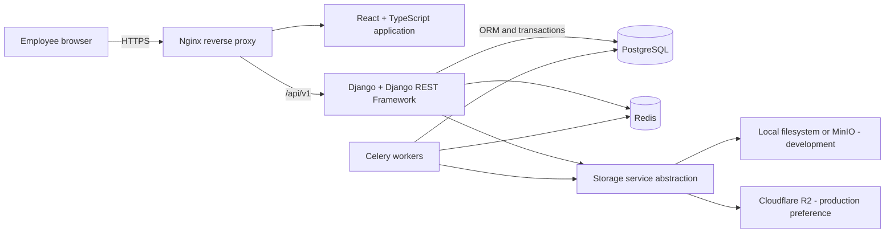
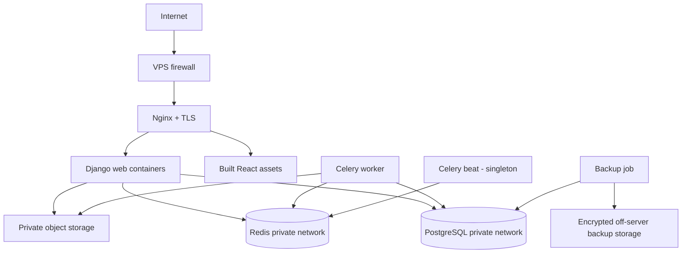

# System Architecture

Status: Phase 0 baseline
Authority: Monika Engineers Integrated ERP specification, sections 0-140
Last updated: 2026-08-10

## 1. Architecture decision

The production system will be a modular monolith: one React application, one Django deployment, one PostgreSQL database, one Redis service, Celery workers, and an object-storage abstraction. Domain boundaries remain explicit inside the monolith so modules can evolve independently without operationally expensive microservices.

The current Axis workspace is a UI proof-of-concept. It is not evidence that production workflows, permissions, APIs, or persistence are complete.

## 2. System context



Employees never connect to PostgreSQL, Redis, Celery, or object storage directly. Database and storage credentials remain server-side.

## 3. Repository target

```text
MonikaERP/
├── frontend/                 React, TypeScript, Vite, Axis CRM UI
├── backend/                  Django modular monolith
│   ├── config/               Settings, URLs, ASGI/WSGI, Celery
│   ├── apps/                 Domain Django applications
│   ├── common/               Small cross-domain primitives only
│   └── tests/                Cross-domain and end-to-end API tests
├── deploy/                   Docker, Compose, Nginx
├── docs/                     Architecture and operating documentation
└── .env.example              Names only; never secrets
```

The existing frontend currently lives at the repository root. Moving it into `frontend/` will occur once Phase 1 begins, in one controlled change that preserves the mockup route and Git history.

## 4. Backend module shape

Each Django domain application follows a small, consistent structure:

```text
apps/<domain>/
├── models.py                 Persistence and database constraints
├── services.py               Commands and business/state transitions
├── selectors.py              Non-trivial reads and optimized queries
├── validators.py             Reusable domain validation when needed
├── permissions.py            Backend authorization policies
├── api/                      Serializers, views, URLs
├── migrations/               Django migrations only
└── tests/                    Model, service, API, permission, workflow tests
```

Additional files are introduced only when the domain has enough code to justify them. Business rules do not live in serializers, views, React components, or model `save()` overrides.

## 5. Domain interaction rules

1. A module may read another module through its public selectors.
2. A module changes another module through public services, never by editing its tables directly.
3. Important state changes use explicit commands such as `submit`, `approve`, `reject`, `release`, `cancel`, `receive`, or `issue`.
4. Cross-module operations run inside database transactions when atomicity is required.
5. Celery handles slow or retryable work such as PDFs, scheduled reminders, exports, and notification delivery; it does not replace synchronous business validation.
6. Domain events are initially in-process records/outbox jobs, not a message-broker architecture.

## 6. Cross-cutting foundations

| Foundation | Responsibility |
|---|---|
| Identity and organization | Separate User and Employee, departments, designations, branches, cost centres and warehouses |
| RBAC | Configurable `module.action` permissions, multiple roles, scoped access and financial/confidential field policies |
| Numbering | Transaction-safe sequences by document type, financial year and optional branch |
| Approval engine | Configurable sequential/parallel approvals and amount/permission conditions |
| Audit | Immutable actor, action, time, entity, request context and before/after evidence |
| Documents | Versioned metadata plus private object storage; temporary authenticated access |
| Notifications | Internal inbox first; email/SMS/WhatsApp/push adapters later |
| Configuration | Company, numbering, tax, financial year, timezone, storage and feature flags |

Final company roles and approver identities remain configurable and are not invented in Phase 0.

## 7. Data integrity rules

- UUID primary identifiers and separate human-readable document numbers.
- Decimal types for money and material quantities; never floating point.
- UTC storage with company/user timezone display; default company timezone is Asia/Kolkata.
- Immutable released drawing, BOM, quotation and other controlled revisions.
- Inventory is a ledger of stock transactions, never an editable material quantity.
- Financial and transactional history uses cancellation/reversal or controlled soft deletion.
- Database unique constraints protect document numbers and released-current revision invariants.
- Transactions and row-level locks protect numbering, approvals, inventory issue, receipt and revision creation.
- Indexed document numbers, dates, statuses, customers, projects, materials, assets and service records.

## 8. Authentication and authorization baseline

The initial browser application will use same-origin Django authentication with secure, HTTP-only cookies and CSRF protection. Token-based access can be added for future mobile and partner APIs without weakening the browser security model.

Every request follows:

```text
authenticate → resolve employee → authorize action and scope → validate command → transact → audit → notify
```

Frontend visibility improves usability but is never treated as security.

## 9. File architecture

The `documents` module owns file metadata, versions, checksums, access rules and relationships. A storage service exposes upload, download, delete-after-retention, and temporary-access operations. Domain modules reference documents through the document service instead of storage provider keys.

Historical engineering revisions are never overwritten. A new revision receives a new metadata record and storage key; only one approved revision can be current/released.

## 10. Deployment topology



Docker Compose is the initial orchestration mechanism for development and the Ubuntu VPS. Secrets are supplied by the deployment environment and never committed.

## 11. Operations and recovery

- Separate application, error, security and immutable business audit logs.
- Health endpoints for web, database, Redis and worker readiness.
- Daily PostgreSQL backups, seven daily copies, weekly copies and optional monthly retention.
- Backups stored outside the primary VPS and periodically restore-tested.
- Object-storage recovery and redeployment steps documented before production launch.
- Human-readable errors to users; internal correlation IDs connect UI errors to server logs.

## 12. Performance posture

The initial target is 30 concurrent employees and growth to hundreds without an architectural rewrite. Pagination, database constraints, optimized ORM queries, appropriate indexes and measured caching are sufficient. Microservices, event streaming and distributed caches are explicitly excluded until proven necessary and separately approved.

## 13. Phase 0 assumptions requiring confirmation

1. One legal company and one default branch at launch, while the model remains multi-branch capable.
2. Same-origin cookie authentication for the internal web application; MFA is readiness work until policy is defined.
3. Cloudflare R2 is the preferred production object store but procurement and data-residency approval are pending.
4. Finance may begin integration-ready before a full internal ledger is enabled; the choice must be confirmed before Phase 13.
5. Payroll, GPS, barcode and advanced mobile features remain feature-flagged until their phases are approved.
6. Company roles, approval limits, tax configuration and document retention rules are outstanding business inputs.
