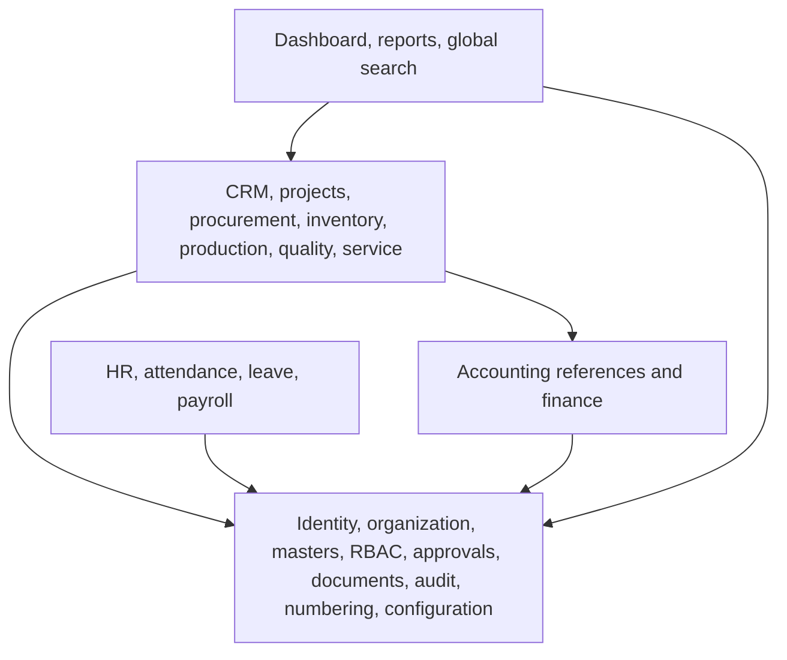

# Module Map

Status: Phase 0 baseline
Rule: modules are Django applications inside one deployable backend.

## 1. Dependency layers

Foundation modules must not depend on operational modules. Reports and dashboards may read optimized projections but do not own operational truth.

## 2. Foundation domains

| Django app | Owns | Public capabilities | Depends on |
|---|---|---|---|
| `accounts` | Login identity, sessions, password/MFA readiness | Authentication, account activation/deactivation | Django auth only |
| `employees` | Employee, department, designation, reporting line | Employee lookup and employment state | accounts, organizations |
| `organizations` | Company, branch, cost centre, warehouse ownership | Organizational scope resolution | — |
| `rbac` | Role, permission, grants, exceptions and scopes | `authorize(user, action, context)` | accounts, employees, organizations |
| `masters` | Shared controlled reference data | Validated master lookups | organizations, audit |
| `numbering` | Document sequences | Atomic next document number | organizations, configuration |
| `approvals` | Rules, requests, steps and decisions | Submit, decide, withdraw, resubmit | rbac, employees, audit |
| `documents` | File metadata, versions, access and storage keys | Upload, version, preview authorization, download | rbac, audit |
| `notifications` | Internal notifications and delivery jobs | Create, mark read, dispatch adapter | employees |
| `audit` | Immutable business and security events | Record/query authorized audit evidence | accounts, employees |
| `configuration` | Company settings, taxes, feature flags | Typed configuration reads | organizations, audit |

## 3. Commercial domains

| Django app | Owns | Upstream | Downstream |
|---|---|---|---|
| `customers` | Customer, contacts, addresses, credit profile | masters | enquiries, sales, projects, assets, service, finance |
| `crm` | Activities, notes, follow-ups, lead context | customers, employees | enquiries, dashboard |
| `enquiries` | RFQs, requirements, lost reasons | customers, crm | engineering_reviews, estimation, quotations |
| `engineering_reviews` | Feasibility, assumptions, clarifications, preliminary BOM/route | enquiries, employees | estimation, engineering, bom |
| `estimation` | Cost estimates and immutable revisions | enquiries, engineering_reviews, masters | quotations, project_costing |
| `quotations` | Quotation revisions, lines, commercial terms and negotiation | estimation, customers, approvals | sales |
| `sales` | Customer POs, sales orders, schedules | quotations, customers, approvals | projects, finance |

## 4. Project and engineering domains

| Django app | Owns | Upstream | Downstream |
|---|---|---|---|
| `projects` | Central project record, milestones, assignments and Project 360 | sales, customers | all execution modules |
| `engineering` | Drawings, drawing revisions, ECR/ECN and release control | projects, documents, approvals | bom, procurement, production, quality |
| `bom` | Product/project BOMs, hierarchy and immutable revisions | engineering, materials | mrp, production, estimation |
| `routing` | Routing revisions and ordered operations | projects, masters | production, estimation, quality |
| `project_documents` | Project document classification and access facade | projects, documents | Project 360 |

Drawing creation remains in engineering tools. The ERP controls upload, preview, revision, approval, release, BOM linkage and downstream impact.

## 5. Supply and manufacturing domains

| Django app | Owns | Upstream | Downstream |
|---|---|---|---|
| `materials` | Material/product/service masters and tracking flags | masters | bom, procurement, inventory, production |
| `mrp` | Requirement runs and suggestions | released bom, projects, inventory, procurement | procurement |
| `procurement` | PR, vendor RFQ, comparison, PO and vendor performance | mrp, vendors, approvals | receiving, finance, project_costing |
| `vendors` | Vendor identity, contacts, categories, compliance | masters | procurement, quality |
| `receiving` | GRN and partial receipts | procurement | quality, inventory |
| `inventory` | Warehouses, bins, stock ledger, reservations, transfers and issues | receiving, quality, materials | production, service, project_costing |
| `production` | Production orders, job cards, WIP, consumption, scrap/rework | projects, bom, routing, inventory | quality, dispatch, project_costing |
| `subcontracting` | Job-work orders, outward material and returns | production, procurement, inventory | quality, project_costing |
| `quality` | Incoming/in-process/final inspections, NCR and CAPA | receiving, production, subcontracting | inventory, dispatch, vendor performance |
| `dispatch` | Packing, partial dispatch, delivery and proof | projects, quality, inventory | installation, assets, finance |
| `installation` | Installation/commissioning jobs and sign-off | dispatch, projects, employees | assets, service |

## 6. Asset and after-sales domains

| Django app | Owns | Upstream | Downstream |
|---|---|---|---|
| `assets` | Customer equipment, serial lifecycle and warranty | projects, dispatch, installation | service, amc |
| `service` | Requests, job cards, schedules, visits, reports, parts and expenses | customers, assets, employees, inventory | finance, project_costing, dashboard |
| `amc` | Opportunities, proposals, contracts, schedules, visits, billing and renewals | customers, assets, service, approvals | finance, notifications |

## 7. Corporate and insight domains

| Django app | Owns | Notes |
|---|---|---|
| `finance` | Chart of accounts, receivables/payables, invoices, payments, journals and accounting references | Can remain integration-ready until Phase 13 is approved |
| `hr` | Employee-sensitive HR profile extensions | Strict field permissions |
| `attendance` | Punches, shifts and attendance calendar | Feature-flagged |
| `leave` | Types, balances, requests and approvals | Integrates with scheduling |
| `payroll` | Structures, earnings, deductions and payslips | Feature-flagged and isolated |
| `reports` | Permission-filtered read models and exports | Never writes operational truth |
| `dashboard` | Role/scoped metrics and action queues | Uses selectors/read models |
| `search` | Global document-number and entity lookup | PostgreSQL first; external search only if measured need appears |

## 8. Ownership rules

- Only `inventory` writes stock ledger entries.
- Only `numbering` allocates official document numbers.
- Only `approvals` records approval decisions; domain services decide what approval means.
- Only the owning domain changes its state.
- Only `documents` accesses the storage provider.
- Only `audit` persists normalized audit events.
- Reports, dashboards and search never bypass RBAC scopes.
- Finance references are recorded from the first relevant phase even if full accounting is not yet active.

## 9. Primary process handoffs

```mermaid
flowchart LR
    CRM["CRM"] --> ENQ["Enquiry"] --> ER["Engineering review"] --> EST["Estimate"] --> QT["Quotation"] --> SO["Sales order"] --> PRJ["Project"]
    PRJ --> ENG["Drawing / ECN"] --> BOM["BOM / routing"] --> MRP["MRP"] --> PROC["Procurement"] --> RCV["GRN"] --> IQC["Incoming QC"] --> INV["Inventory"]
    INV --> PROD["Production"] --> PQC["In-process / final QC"] --> DSP["Dispatch"] --> INST["Installation"] --> ASSET["Customer asset"] --> SVC["Service"] --> AMC["AMC"]
```

