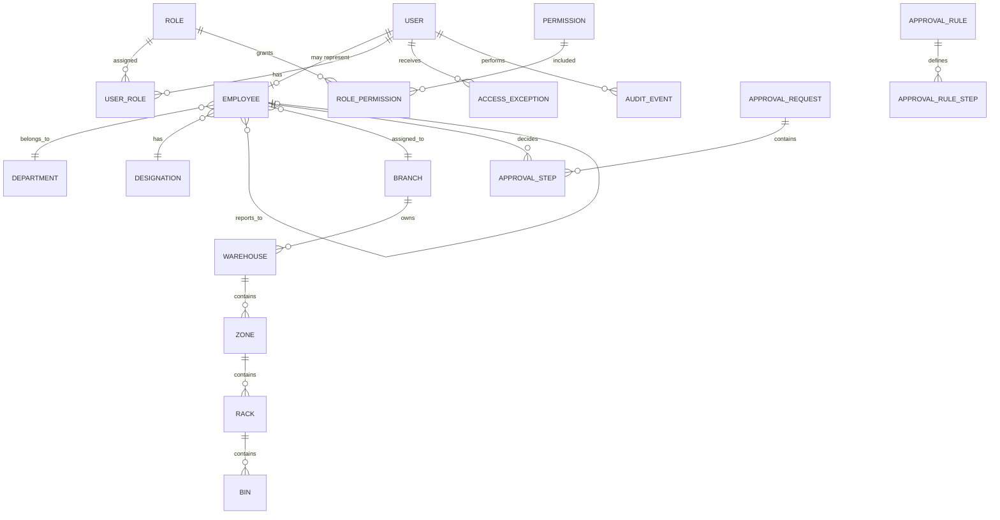
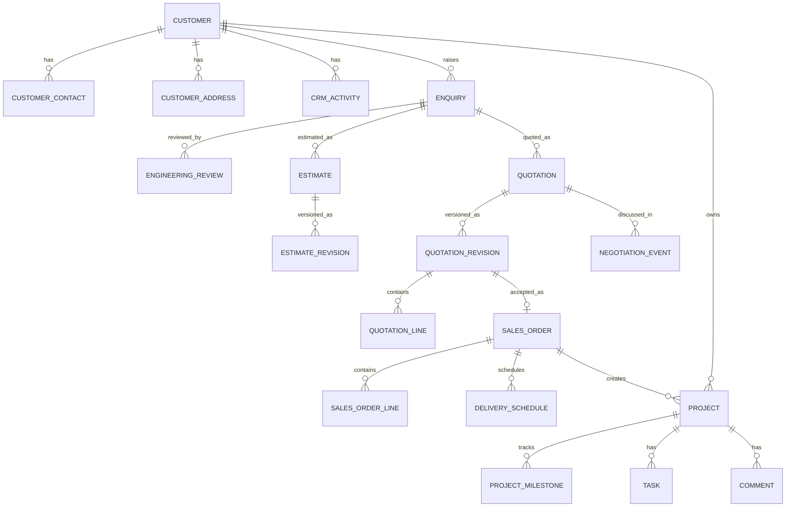
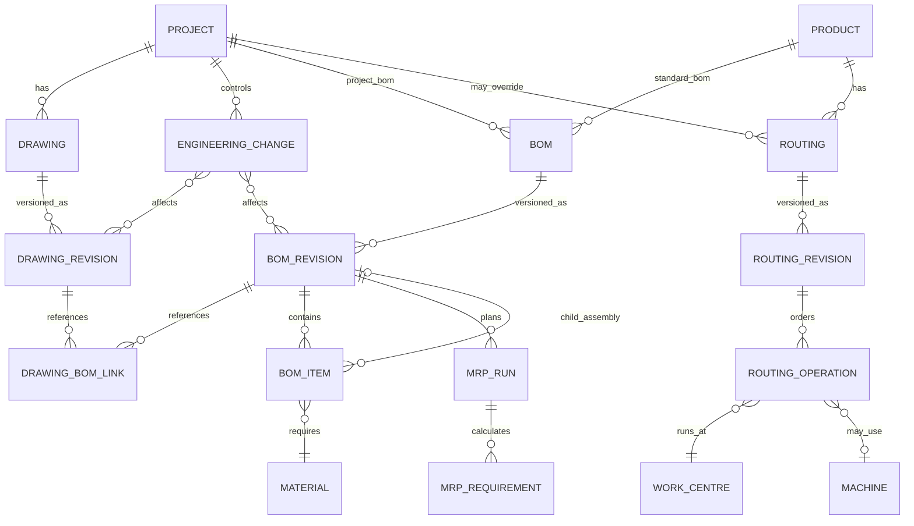
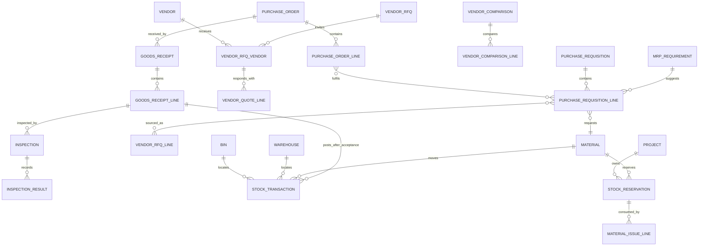
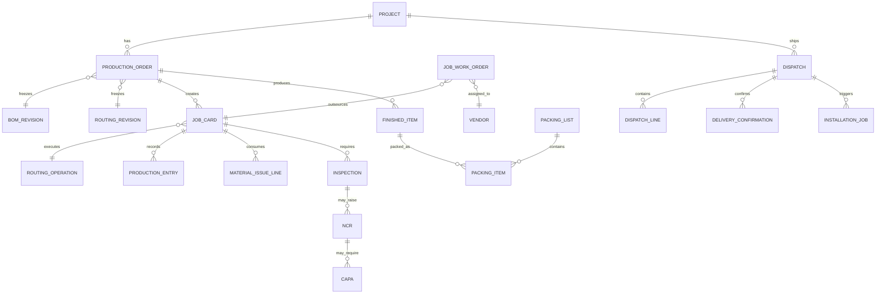
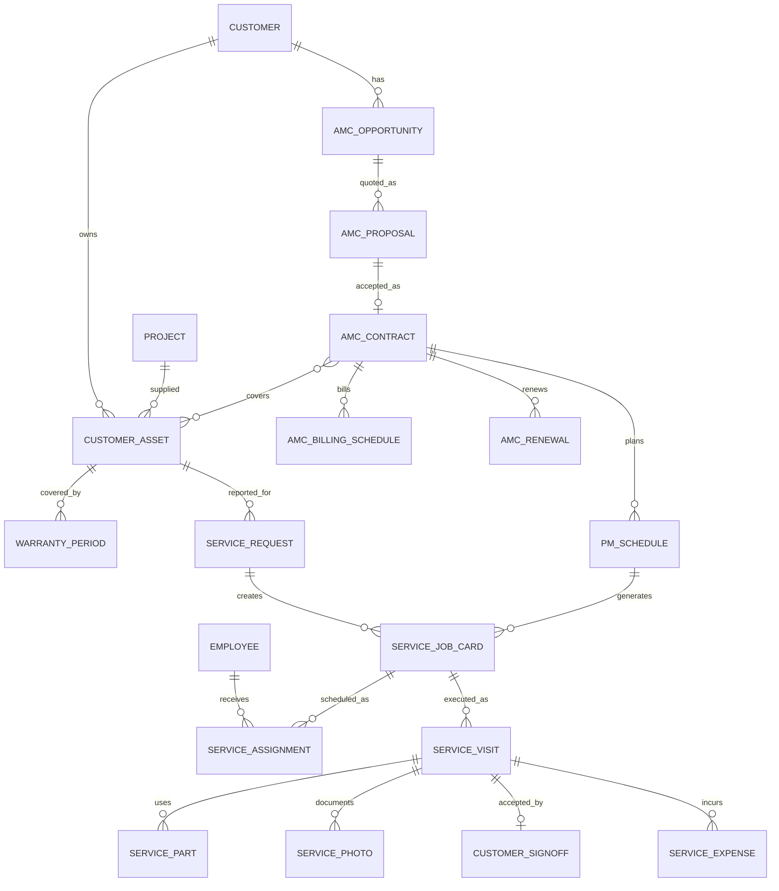
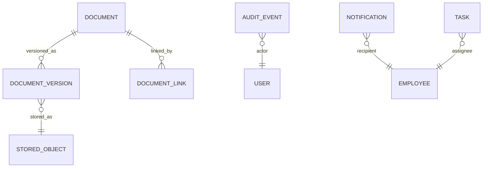

# Entity Relationship Model

Status: conceptual Phase 0 model. Physical field definitions and migrations are produced at each implementation phase.

## 1. Shared conventions

Important entities use UUID primary keys, separate official document numbers, audit timestamps/actors and controlled status fields. Controlled documents use a stable root record plus immutable revision records.

## 2. Identity, organization and control

Scope grants/exceptions can reference department, branch, warehouse, ownership rules and field policies. Exact role assignments remain configurable.

## 3. Customer-to-project lifecycle

Conversion services copy approved source data once and retain references; users do not manually re-enter accepted quotation data.

## 4. Engineering and planning

Only one released/current revision is allowed per drawing/BOM/routing root, enforced by service logic and database constraints.

## 5. Procurement, receipt and inventory

Stock balance is derived from accepted ledger transactions. Reservations affect available-to-promise stock without changing physical stock.

## 6. Production, quality and dispatch

Final-QC approval is a dispatch prerequisite unless an authorized, audited deviation exists.

## 7. Assets, service and AMC

## 8. Documents, comments and events

`DOCUMENT_LINK`, audit subject references, comments and tasks use a controlled content-type/reference mechanism with service validation. They do not grant access by themselves.

## 9. Physical-model rules reserved for phase design

- Human-readable numbering and uniqueness scopes.
- Revision uniqueness and one-current constraints.
- Check constraints for non-negative quantities and valid date ranges.
- Deferred constraints for balanced accounting entries.
- Partial receipt, issue and dispatch quantities computed from immutable line movements.
- Serial/batch uniqueness and traceability rules activated by material flags.
- Retention policies for audit, finance, engineering and HR documents.
