# Workflow and State Diagrams

Status: Phase 0 baseline. Final transition permissions and approval limits require business confirmation.

## 1. End-to-end operational lifecycle

```mermaid
flowchart LR
    Customer --> Enquiry --> Review["Requirement and engineering review"] --> Estimate --> Approval1["Internal approval"] --> Quotation --> Negotiation --> CPO["Customer PO"] --> SO["Sales order"] --> Project
    Project --> Drawing --> BOM --> MRP --> PR["Purchase requisition"] --> VRFQ["Vendor RFQ"] --> Compare["Vendor comparison"] --> PO["Purchase order"] --> GRN
    GRN --> IQC["Incoming QC"] --> Inventory --> Reservation --> Issue["Material issue"] --> Production --> JobCards["Job cards"] --> IPQC["In-process QC"] --> FQC["Final QC"]
    FQC --> Packing --> Dispatch --> Delivery --> Installation --> Acceptance --> Asset --> Warranty --> Service --> AMC --> Renewal --> Closure["Project closure"]
```

Each arrow represents a validated domain command and auditable handoff, not a free-form status change.

## 2. Enquiry and quotation

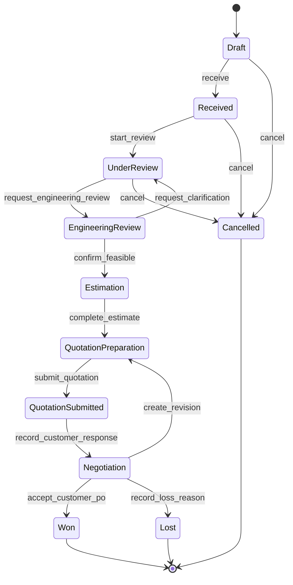

Quotation revisions are immutable. A revision follows Draft → Submitted for Approval → Approved → Sent to Customer. Rejection returns work to a new editable revision; it never mutates an approved revision.

## 3. Drawing, BOM and engineering change

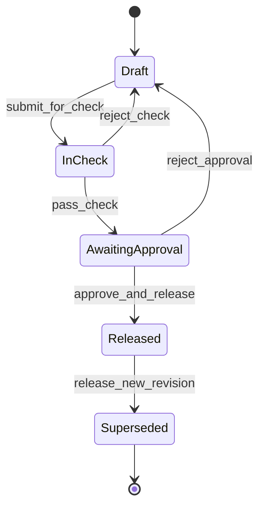

Creating a revision clones the last allowed baseline into a new Draft. Release performs one transaction that validates approvals, marks the prior released revision Superseded, marks the new revision Released, records audit evidence and notifies affected teams. Released content cannot be edited.

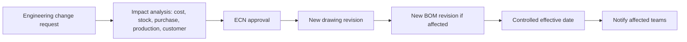

## 4. Purchase requisition and purchase order

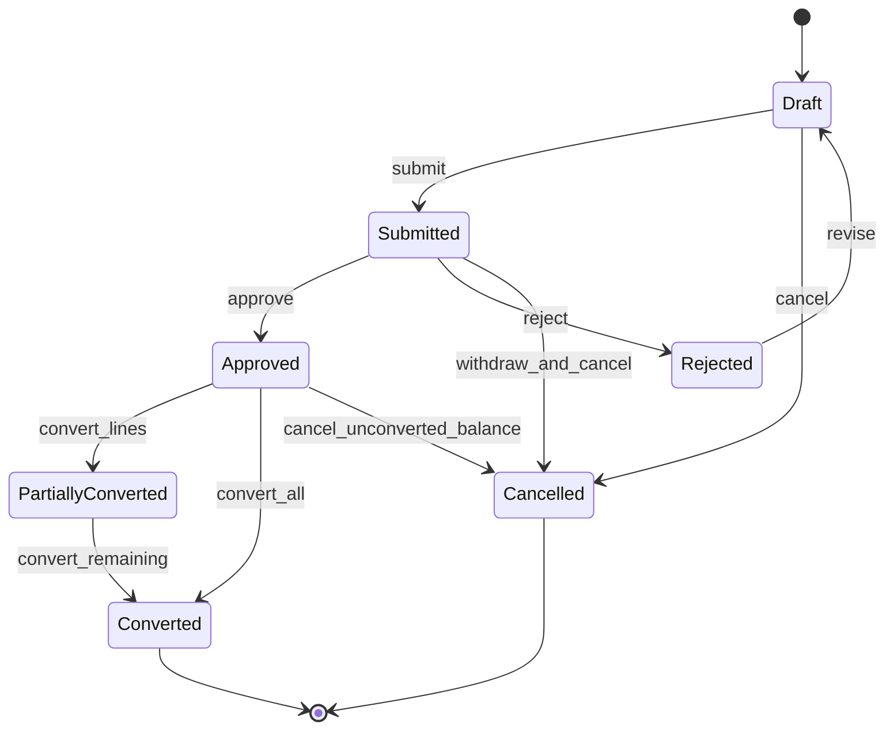

One PR may feed several POs and one PO may consolidate lines from several approved PRs. Conversion quantities are ledgered so remaining quantities are derived, not manually edited.

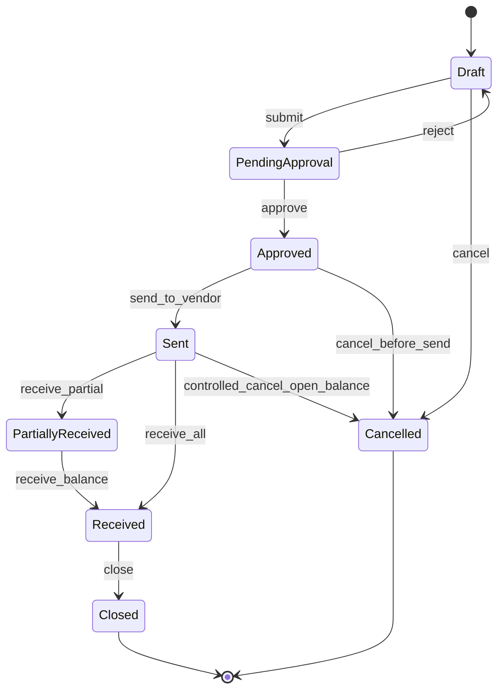

## 5. Receipt, incoming quality and stock

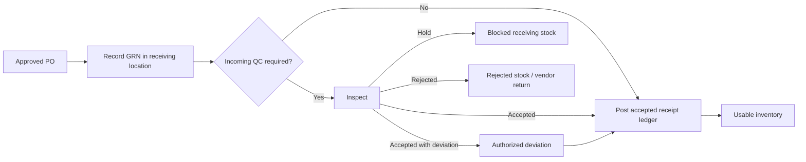

Goods receipt, PO received quantities, inspection disposition, stock ledger entries and audit events are transactionally consistent. Rejected or held material is never available for issue.

## 6. Inventory reservation and issue

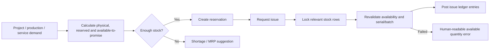

## 7. Production, quality and dispatch

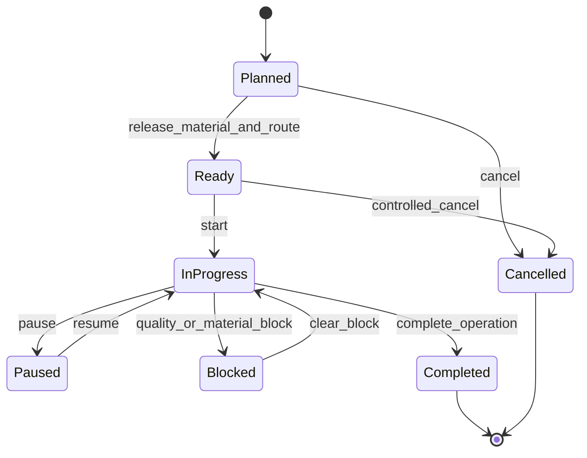

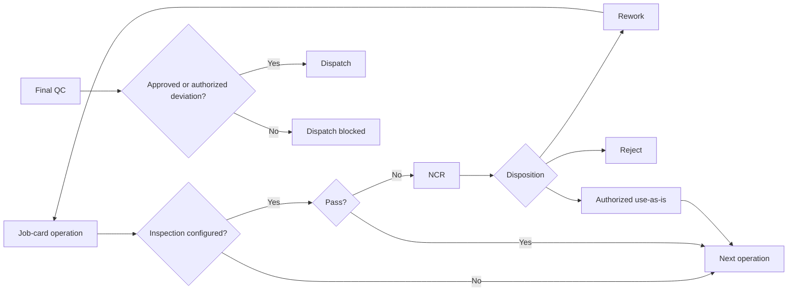

## 8. Service request and field execution

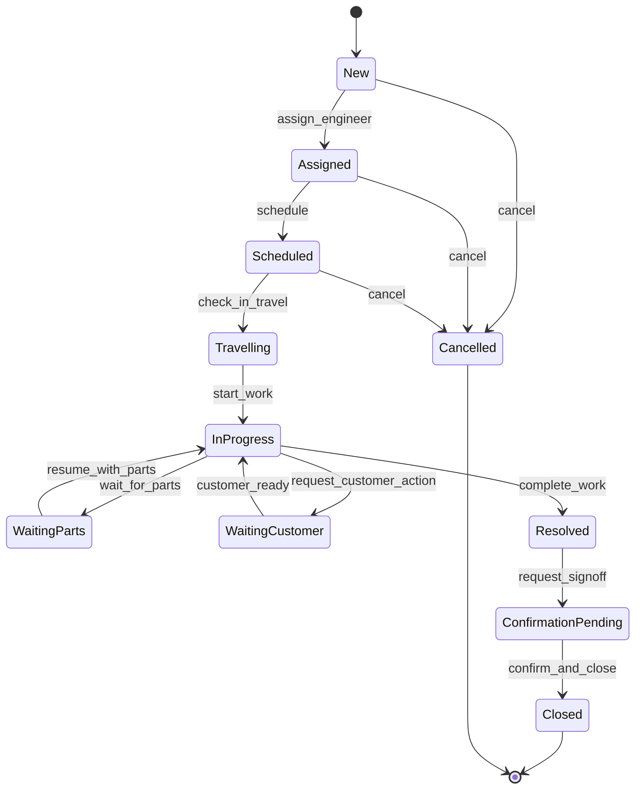

Closure validates configured requirements: service report, parts, expenses and customer acknowledgement. GPS remains feature-flagged.

## 9. AMC lifecycle

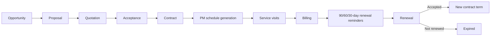

## 10. Generic approval state

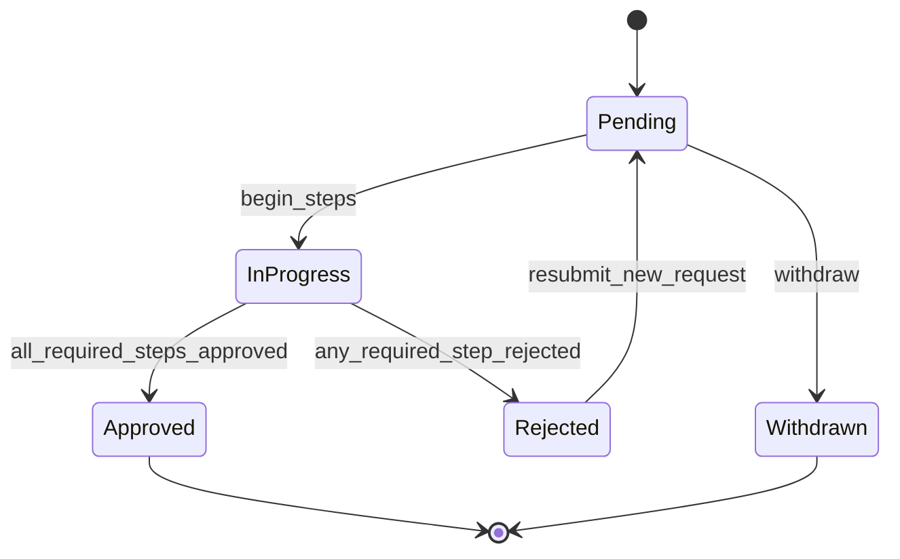

The approval engine records decisions; the owning domain service performs the resulting domain transition after revalidating current state and dependencies.

## 11. Universal transition checks

Every important command answers:

- Is the current state eligible?
- Does the user have action permission and the correct record/branch/warehouse scope?
- Are mandatory fields, documents and dependencies complete?
- Has another user changed the record since it was loaded?
- What happens to partial quantities and open balances?
- What audit event and notification are required?
- Is the operation atomic, and which rows require locks?
