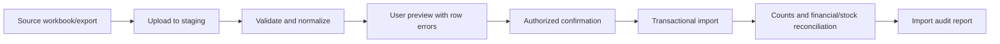

# Migration and Development Plan

Status: Phase 0 baseline
Delivery method: gated phases on a modular-monolith foundation.

## 1. Delivery rules

1. No phase is complete with CRUD alone; the specification's Definition of Done applies.
2. Every phase begins with confirmed workflow, entities, permissions, transitions, integrations and acceptance tests.
3. Every phase ends with migrations, tests, documentation, traceability updates and regression verification.
4. Critical failures block the next phase.
5. Later functionality may be inactive, but its necessary identifiers, references and invariants are preserved.
6. Final roles, approval limits and tax rules remain configurable business data.

## 2. Phase gates

| Phase | Scope | Entry decisions | Required exit evidence |
|---|---|---|---|
| 0 | Requirements and domain model | Authoritative scope received | Seven architecture artifacts reviewed; assumptions and open decisions logged |
| 1 | Auth, employees, departments, RBAC, audit, masters, documents, configuration | Identity policy, org structure, initial master owners | Permission and audit tests; secure auth; storage abstraction; one-command dev setup |
| 2 | CRM, customer, enquiry, engineering review, estimation, quotation | Sales/engineering handoff, quotation format and approval policy | Enquiry-to-approved-quotation workflow, revisions, PDF and permission tests |
| 3 | Sales order, project, drawing, BOM, ECN, routing | Project numbering, drawing/BOM release policy | Approved quotation conversion; Project 360; immutable revisions; drawing/BOM workflow tests |
| 4 | MRP, PR, vendor RFQ/comparison, PO | Planning assumptions and procurement approvals | MRP calculation tests; PR/PO partial conversion; approved PO PDF |
| 5 | GRN, incoming QC, inventory, reservations, issues | Warehouse/bin model, inspection policy, opening-stock method | Ledger reconciliation; transaction/lock tests; rejected stock blocked |
| 6 | Production, job cards, WIP, subcontracting | Routing and shop-floor recording rules | Material-to-WIP trace, job operations, subcontract returns and costing evidence |
| 7 | In-process/final QC, NCR, CAPA | Inspection plans and deviation authority | Failed inspection blocks next stage/dispatch; NCR/CAPA closure tests |
| 8 | Packing, dispatch, delivery, installation | Dispatch documents and sign-off policy | Partial dispatch, serial packing, proof of delivery and installation acceptance |
| 9 | Assets, warranty, service | Asset numbering, warranty and service closure policy | Asset 360; service assignment-to-signoff; parts and service history traceability |
| 10 | AMC | Contract, SLA, visit and billing policy | Schedule generation, visit completion, reminders and renewal history |
| 11 | Reports, MIS, dashboards, notification improvements | KPI definitions and recipients | Source-backed reports; filter/permission tests; export auditability |
| 12 | HR, attendance, leave, payroll | HR privacy, attendance and statutory requirements | Sensitive-field permissions and approved HR/payroll workflows |
| 13 | Finance/accounting | Internal accounting vs integration decision | Balanced transactions, posting controls, tax configuration and financial reports |
| 14 | Barcode, warehouse/mobile improvements, integrations | Hardware and integration contracts | Scan-ready workflows, mobile validation and adapter-specific tests |

## 3. Immediate sequence

### Phase 0 — current

- Complete architecture, module map, ER model, state diagrams, API plan, this development plan and traceability.
- Review assumptions with Monika Engineers process owners.
- Select one accountable owner each for Sales, Engineering, Purchase, Stores, Production, Quality, Dispatch, Service, HR and Finance.
- Capture current forms, numbering, spreadsheets, approvals and exceptions before model finalization.

### Phase 1 — next after approval

- Reorganize the repository into `frontend/`, `backend/`, `deploy/` and `docs/`.
- Scaffold one Django project and only the Phase 1 Django apps.
- Add PostgreSQL, Redis and object-storage development services using Docker Compose.
- Implement User separately from Employee.
- Implement configurable RBAC, numbering, audit, approvals, documents, master data and company settings.
- Integrate the React Axis CRM shell with `/api/v1/auth/me/` and permission-aware navigation.
- Preserve `/mockups/axis` as a non-production design reference until equivalent production screens replace it.

## 4. Frontend implementation policy

- Axis CRM is the visual source of truth, not a generic admin template.
- React Router owns routes; TanStack Query owns server-state caching; React Hook Form plus Zod handles form UX validation.
- Server validation remains authoritative.
- Shared ERP components cover page headers, filters, tables, statuses, metrics, timelines, process steppers, detail panels, documents, approvals and empty/error/loading/permission states.
- Desktop is primary; service, installation, approvals and stock operations receive deliberate tablet/mobile treatment.
- Project 360 and the Drawing/BOM workspace receive dedicated enterprise layouts with revision, approval, preview and downstream-impact context.
- Accessibility, keyboard operation and reduced-motion behavior are part of Definition of Done.

## 5. Backend implementation policy

- Django services implement commands; DRF views translate HTTP to service calls.
- Django ORM is the default persistence interface. Separate repositories are introduced only when a real alternate persistence boundary exists.
- Selectors centralize non-trivial, permission-scoped or optimized reads.
- Database constraints protect invariants; services produce useful business errors.
- Celery is used for slow/retryable tasks, not routine request logic.
- No AI assistant and no microservices.

## 6. Testing pyramid per phase

| Test | Purpose |
|---|---|
| Model/constraint | Money/quantity precision, uniqueness, revision and check constraints |
| Service | State rules, conversions, partial operations, cancellation and rejection |
| Permission | Action, scope, confidential field and approval authority |
| API | Contract, filters, pagination, validation and human-readable errors |
| Transaction/concurrency | Numbering, approvals, inventory, receipts and revisions |
| Frontend component/route | Axis states, forms, tables, permissions and accessibility |
| End-to-end | Required cross-module business lifecycles |

CI must run backend tests, frontend type checking, linting, builds, migration checks and OpenAPI compatibility checks.

## 7. Data migration and cutover

### Discovery

Inventory current Excel files and systems for customers, vendors, materials, employees, opening stock and active transactions. Identify owner, source quality, duplicate rules and retention need for each dataset.

### Import process

Imports never write directly to production tables without validation preview and authorization.

### Cutover posture

- Agree a cutover date rather than migrating unnecessary history.
- Import controlled masters first.
- Import open operational records only after their owning module is production-ready.
- Load opening stock through explicitly marked opening transactions, not editable balances.
- Preserve source IDs and an import batch reference for reconciliation.
- Rehearse migration on a production-like copy and record timing and rollback steps.

## 8. Environments

| Environment | Data | Purpose |
|---|---|---|
| Local | Synthetic development seed only | Developer work and automated tests |
| Test/CI | Ephemeral synthetic data | Repeatable verification |
| Staging/UAT | Sanitized or explicitly approved test data | Process-owner acceptance and migration rehearsal |
| Production | Live business data | Authorized daily operations |

Production seed/demo data is prohibited.

## 9. Deployment and rollback

1. Build immutable frontend/backend images.
2. Run tests and migration-plan checks.
3. Back up database and verify backup completion.
4. Deploy application containers.
5. Run forward-only Django migrations with a documented compatibility window.
6. Verify health, authentication and critical smoke workflows.
7. Roll back application image when compatible; restore database only under the documented disaster procedure.

Destructive schema changes use expand-and-contract releases so old and new code can coexist during deployment.

## 10. Backup and disaster-readiness milestones

- Phase 1: automated database backup job and restore runbook skeleton.
- Before first production data: off-server encrypted backups and successful restore test.
- Before document production use: object-storage versioning/recovery test.
- Quarterly after go-live: recorded recovery exercise.

## 11. Business decisions required before Phase 1 completion

| Decision | Owner to nominate | Blocks |
|---|---|---|
| Legal company, branches, warehouses and cost centres at launch | Management/Finance | Organization and access scopes |
| Employee identity, login identifier, password, MFA and session policy | Management/IT | Authentication |
| Initial roles, permissions and scope restrictions | Department heads | RBAC assignments and tests |
| Approval matrices and financial thresholds | Management/Finance | Approval configuration |
| Document numbering and financial year conventions | Finance/Operations | Numbering engine seed |
| Tax masters and GST handling | Finance | Commercial masters |
| Drawing/BOM checking and release authority | Engineering | Phase 3 workflows |
| Document retention and allowed file types/sizes | Management/IT | Storage policy |
| Hosting, R2/data residency and backup destination | Management/IT | Production infrastructure |
| Full internal accounting versus external integration | Finance | Phase 13 scope |

## 12. Change control

Every requirement change records affected process, entities, API, migration, compatibility, tests, documents and traceability IDs. Workarounds that bypass domain ownership, revision control, permissions, ledgers or audit are rejected.
